# TigerGraph GraphQL Service

## 1. Introduction

TigerGraph GraphQL Service enables our users to access graph data in TigerGraph using GraphQL queries. Now you will be able to use any GraphQL client or to simply submit GraphQL queries directly to the service in order to quickly access the graph data in TigerGraph. In the near future the service will also support data update operations via GraphQL mutations.

## 2. Quick Start

### Prerequisite

Download the service binary from this table based on your OS:

| OS           | Link          |
|--------------|---------------|
| Linux X86_64 | [Download here](https://tigergraph-release-download.s3.us-west-1.amazonaws.com/tigergraphql/tigergraph-graphql-0.7.1-linux-x86_64.tar.gz) |
| MacOS x64    | [Download here](https://tigergraph-release-download.s3.us-west-1.amazonaws.com/tigergraphql/tigergraph-graphql-0.7.1-macos-x64.tar.gz) |
| Windows x64  | [Download here](https://tigergraph-release-download.s3.us-west-1.amazonaws.com/tigergraphql/tigergraph-graphql-0.7.1-windows-x64.zip) |

Download the example TigerGraph solution at https://github.com/TigerGraph-DevLabs/TigerGraphQL/raw/0.7/tigergraphql_example_solution.tar.gz. 

Download the example data set at https://github.com/TigerGraph-DevLabs/TigerGraphQL/raw/0.7/tigergraphql_example_data.zip.

Download the example web application from https://github.com/TigerGraph-DevLabs/TigerGraphQL/raw/0.7/tigergraphql_example_react.zip.

Watch this video to setup step by step:

[](https://www.youtube.com/watch?v=myQT9kv7SnU)

Or follow the steps below:

### Setup TigerGraph

Suppose you already have a running TigerGraph instance either locally or on https://tgcloud.io/. Go to GraphStudio homepage, and import the solution tarball tigergraphql_example_solution.tar.gz you just downloaded. It takes around 1 minute.

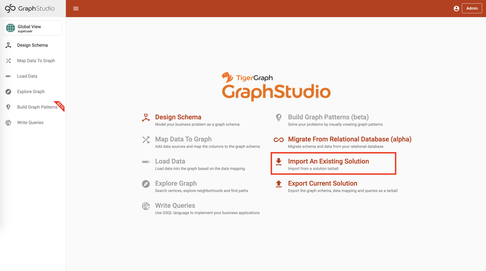

Switch to DemoGraph from the graph list.

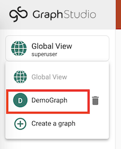

Go to Map Data To Graph page.

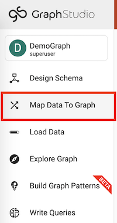

Click Add data file button from the toolbar

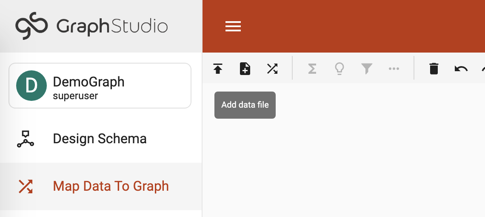

Unzip tigergraphql_example_data.zip, then upload all the CSV files from the decompressed folder. 

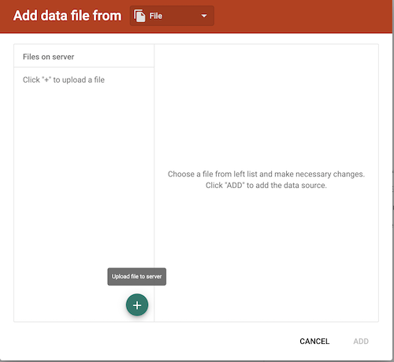

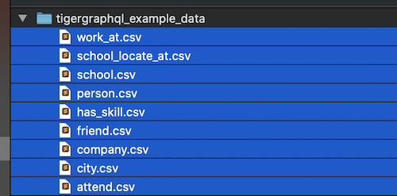

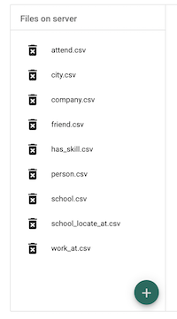

Go to Load Data page

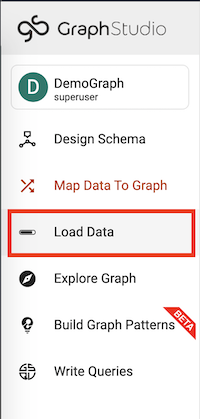

Click Start Loading button and confirm to load the data to the graph.

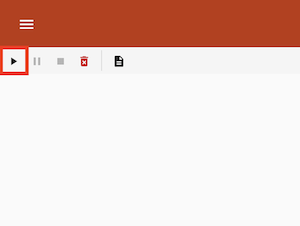

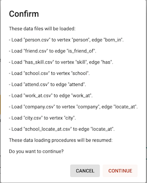

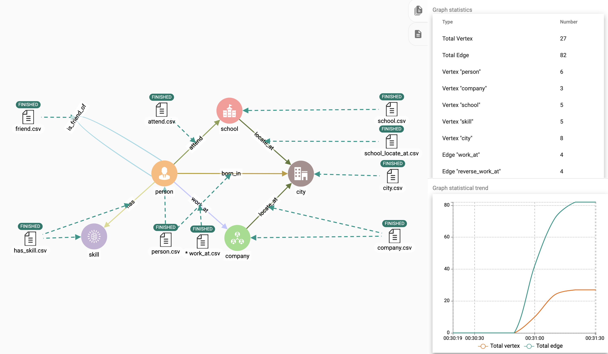

Now your graph is ready to use.

### Start TigerGraph GraphQL Service

For Linux/MacOS, decompress the binary tarball, and there will be a binary named tigergraphql.
Run the following command from the terminal to start the service and connect to the TigerGraph instance:

```bash
./tigergraphql -s http://<url-to-tigergraph:port> -p 4000 -u tigergraph -w tigergraph -g DemoGraph
```

For Windows, unzip the binary zip file, and there will be an executable tigergraphql.exe.
Run the executable with the following command to start the service and connect to the TigerGraph instance:

```bash
tigergraphql.exe -s http://<url-to-tigergraph:port> -p 4000 -u tigergraph -w tigergraph -g DemoGraph
```

The URL and port is the URL and port you use to access GraphStudio in the browser. If you are accessing a tgcloud instance, usually you will need to use https and no port is needed.
If the connection is successful, you will see something like this in the terminal:

```bash
> ./tigergraphql -s https://xxxxxx -p 4000 -u tigergraph -w tigergraph -g DemoGraph

2021-11-24 00:22:48.756 I | web/web.go:83] Schema is loaded
2021-11-24 00:22:48.756 I | web/web.go:89] Start to serve at http://0.0.0.0:4000
```

Here is a detailed explanation of the parameters:

| Parameter | Explanation |
|-----------|-------------|
| -s | The TigerGraph server URL (usually include :14240 port) |
| -p | The port the TigerGraph GraphQL service is serving |
| -u | GSQL username |
| -w | GSQL password |
| -g | The graph name to connect to |

Now you can access the GraphQL API from the browser with http://localhost:4000. (If you are running this service in a different machine, replace localhost with the IP or URL of that machine)

Let’s run a sample query to get all persons and the city they were born at:

```
query {
  DemoGraph {
    person {
      name
      born_in {
        birthday
        to {
          name
        }
      }
    }
  }
}
```

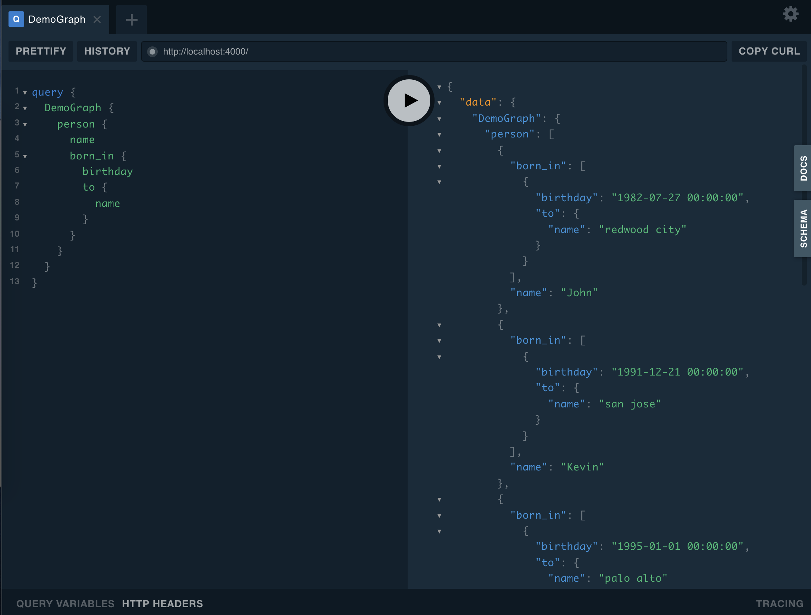

### Run the example web application

Unzip tigergraphql_example_react.zip, and use the command line terminal to go to the folder.

```bash
cd tigergraphql_example_react
```

(Optional) If the TigerGraph GraphQL service is running on another machine, change config.json with the IP and port to that machine:

```json
{
    "GRAPHQL_API": "http://localhost:4000/graphql"
}
```

Use python to serve the app:

```bash
> python server.py
serving at port 3000
```

Open http://localhost:3000 in browser to explore the web application:

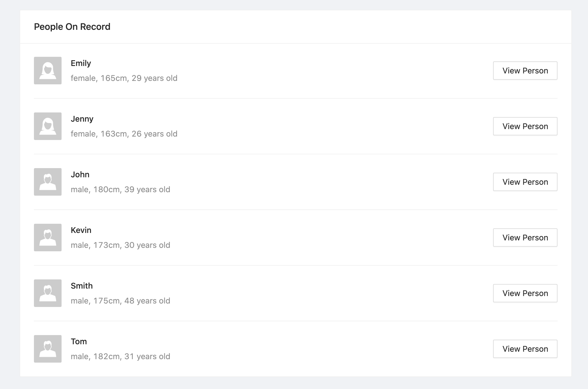

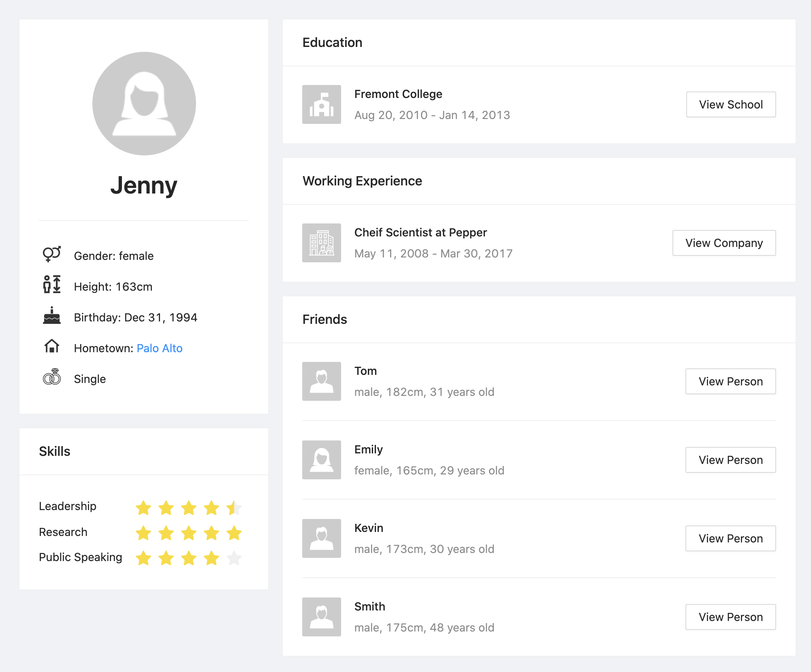

The web application serves as a reference for helping the users to quickly onboard TigerGraph GraphQL service. It is open-sourced under example-react folder.

## 3. Documentation

See the full documentation at https://docs.tigergraph.com/graphql/0.7.

## 4. License

TigerGraph GraphQL service is an optional feature of the TigerGraph database product. It shares the same license agreement with the TigerGraph database product.
