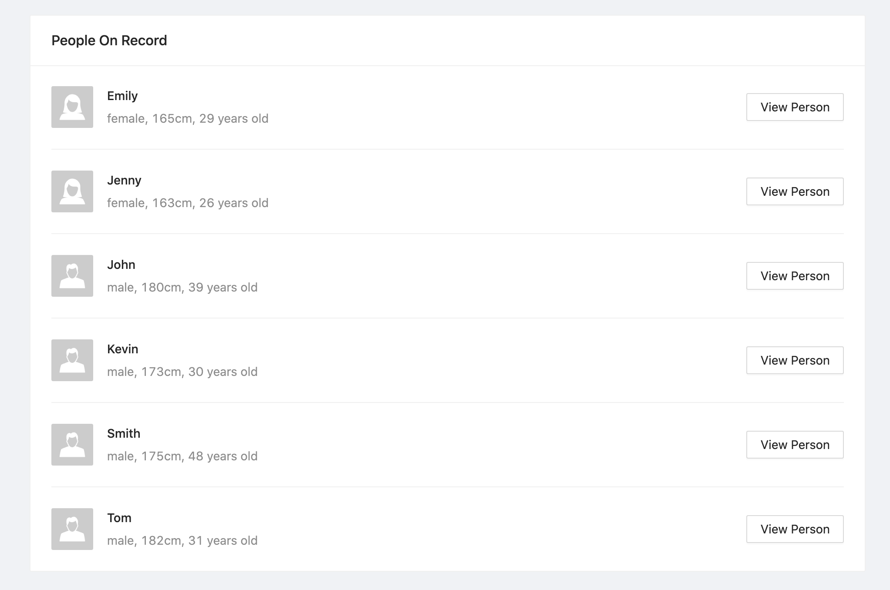

# TigerGraph GraphQL Example Web Application

This is an example web application built with TigerGraph GraphQL + React + Apollo.

## Prerequisites

- nodejs

    You can install from https://nodejs.org/en/download/

- yarn

    Install using
    ```bash
    npm install --global yarn
    ```

## Local development

- Install dependencies and build the web application

    ```bash
    yarn
    yarn build
    ```

- (Optional) Modify public/config.json to direct to TigerGraph GraphQL service URL

    ```json
    {
      "GRAPHQL_URL": "http://localhost:8080/graphql"
    }
    ```

- Launch the web application locally

    ```bash
    yarn start
    ```

## Screenshots

If the application starts successfully, you will see the page below loaded:



Click View Person button of any record, you will see a similar page like below loaded:


